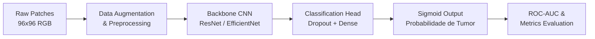

# 🔬 Histopathologic Cancer Detection — MC906 (IC / UNICAMP)

[](https://www.python.org/)
[](https://pytorch.org/)
[](https://www.kaggle.com/c/histopathologic-cancer-detection)
[](https://www.ic.unicamp.br/)
[](LICENSE)

Projeto desenvolvido para a disciplina **MC906 — Introdução à Inteligência Artificial** do **Instituto de Computação (IC) da Universidade Estadual de Campinas (UNICAMP)**.

O objetivo do projeto é a **identificação automatizada de metástase de câncer em biópsias de linfonodos**, a partir da classificação binária de imagens histopatológicas (*PatchCamelyon benchmark / Kaggle Challenge*).

---

## 📌 Sumário

- [Visão Geral](#-visão-geral)
- [Descrição do Problema & Dataset](#-descrição-do-problema--dataset)
- [Arquitetura & Metodologia](#-arquitetura--metodologia)
- [Estrutura do Repositório](#-estrutura-do-repositório)
- [Instalação e Configuração](#-instalação-e-configuração)
- [Como Executar](#-como-executar)
- [Resultados e Avaliação](#-resultados-e-avaliação)
- [Interpretabilidade (Grad-CAM)](#-interpretabilidade-grad-cam)
- [Autores & Agradecimentos](#-autores--agradecimentos)
- [Licença](#-licença)

---

## 🩺 Visão Geral

A detecção precoce e precisa de metástases em linfonodos é uma etapa crítica no estadiamento do câncer de mama e no planejamento terapêutico de pacientes oncológicos. No entanto, o exame histopatológico manual de lâminas digitalizadas (*Whole-Slide Images — WSI*) é uma tarefa laboriosa, demorada e suscetível à variabilidade inter e intra-observador.

Este projeto propõe uma abordagem de **Deep Learning / Visão Computacional** baseada em Redes Neurais Convolucionais (CNNs) e Transfer Learning para classificar pequenos fragmentos (*patches*) de tecido como contendo ou não células tumorais malignas.

---

## 📊 Descrição do Problema & Dataset

O projeto utiliza a base do desafio do Kaggle [Histopathologic Cancer Detection](https://www.kaggle.com/c/histopathologic-cancer-detection), adaptada do benchmark **PatchCamelyon (PCam)**.

<div align="center">
  <table>
    <tr>
      <td align="center"><b>Dimensões da Imagem</b></td>
      <td align="center">96 × 96 pixels (RGB)</td>
    </tr>
    <tr>
      <td align="center"><b>Região de Decisão (ROI)</b></td>
      <td align="center">Centro de 32 × 32 pixels</td>
    </tr>
    <tr>
      <td align="center"><b>Classes</b></td>
      <td align="center"><code>0</code>: Tecido Saudável / Sem Tumor<br><code>1</code>: Tecido Metastático (≥ 1 pixel tumoral no centro)</td>
    </tr>
    <tr>
      <td align="center"><b>Total de Amostras (Treino)</b></td>
      <td align="center">~220.025 imagens rotuladas</td>
    </tr>
    <tr>
      <td align="center"><b>Métrica Oficial</b></td>
      <td align="center"><b>ROC-AUC</b> (Area Under the ROC Curve)</td>
    </tr>
  </table>
</div>

> ⚠️ **Regra Fundamental do Dataset:** A presença de tecido tumoral na periferia do patch (fora da região central de 32×32 px) **não** afeta o rótulo da imagem. O modelo deve focar estritamente na área central para emitir sua predição.

---

## 🧠 Arquitetura & Metodologia

O pipeline foi estruturado em quatro etapas principais:



### 1. Pré-processamento & Data Augmentation
- **Recorte / Atenção Espacial:** Enfoque na região central (32×32 ou 64×64 com contexto circundante).
- **Aumentação de Dados em Tempo de Treinamento:**
  - Espelhamento horizontal e vertical (*Random Horizontal/Vertical Flip*).
  - Rotações aleatórias em 90°, 180° e 270°.
  - Ajustes suaves de cor (*ColorJitter*: brilho, contraste e saturação) para lidar com variações de coloração histológica (H&E).
  - Normalização baseada nas médias e desvios padrão do ImageNet.

### 2. Modelagem & Transfer Learning
Foram exploradas e comparadas diversas arquiteturas pré-treinadas:
- **Baseline:** CNN customizada de 4 blocos convolucionais.
- **ResNet-34 / ResNet-50:** Conexões residuais profundas com excelente convergência.
- **EfficientNet-B0 / B2:** Alto desempenho com menor custo computacional (Compound Scaling).
- **DenseNet-121:** Reuso intensivo de features, altamente eficaz para imagens biomédicas.

### 3. Treinamento & Otimização
- **Função de Perda:** `BCEWithLogitsLoss` (Binary Cross-Entropy com Logits).
- **Otimizador:** AdamW (`lr=1e-4`, `weight_decay=1e-4`).
- **Scheduler:** `CosineAnnealingLR` ou `ReduceLROnPlateau`.
- **Estratégias de Treinamento:**
  - *Fine-tuning* com congelamento inicial das camadas convolucionais.
  - *Mixed Precision Training* (FP16 / PyTorch AMP) para aceleração do treinamento.
  - Validação cruzada estratificada (*Stratified K-Fold*) para validação robusta.

---

## 📁 Estrutura do Repositório

```text
MC906-Histopathologic-Cancer-Detection/
│
├── data/
│   ├── raw/                  # Dados brutos baixados do Kaggle (.zip / extraídos)
│   ├── processed/            # Dados particionados (treino/validação/teste)
│   └── train_labels.csv      # Rótulos das amostras de treino
│
├── notebooks/
│   ├── 01_eda.ipynb          # Análise exploratória dos dados e distribuição das classes
│   ├── 02_training.ipynb     # Treinamento e ajuste fino dos modelos
│   └── 03_evaluation.ipynb   # Avaliação, matriz de confusão, curva ROC e inferência
│
├── src/
│   ├── __init__.py
│   ├── dataset.py            # PyTorch Dataset e pipelines de transformação (Torchvision/Albumentations)
│   ├── models.py             # Definição das arquiteturas e cabeçalhos de classificação
│   ├── train.py              # Loop de treino, validação, early stopping e salvamento de checkpoints
│   ├── evaluate.py           # Cálculo de métricas (ROC-AUC, F1, Acurácia) e geração de gráficos
│   └── utils.py              # Funções utilitárias (seed, plot, logs)
│
├── models/                   # Pesos salvos dos modelos treinados (.pt / .pth)
├── reports/                  # Relatório técnico e visualizações geradas (PDF, figuras)
├── requirements.txt          # Dependências do projeto
├── .gitignore
├── LICENSE                   # Licença MIT
└── README.md                 # Documentação do projeto
```

---

## 🚀 Instalação e Configuração

### 1. Clonar o Repositório
```bash
git clone https://github.com/pancollenn/MC906-Histopathologic-Cancer-Detection.git
cd MC906-Histopathologic-Cancer-Detection
```

### 2. Criar e Ativar Ambiente Virtual
```bash
# Linux / macOS
python3 -m venv venv
source venv/bin/activate

# Windows
python -m venv venv
.\venv\Scripts\activate
```

### 3. Instalar Dependências
```bash
pip install --upgrade pip
pip install -r requirements.txt
```

<details>
<summary><b>Exemplo de Dependências Principais (requirements.txt)</b></summary>

```text
torch>=2.0.0
torchvision>=0.15.0
numpy>=1.23.0
pandas>=2.0.0
scikit-learn>=1.2.0
albumentations>=1.3.0
matplotlib>=3.7.0
seaborn>=0.12.0
tqdm>=4.65.0
kaggle>=1.5.13
jupyterlab>=4.0.0
```
</details>

### 4. Download do Dataset via Kaggle API
Configure sua chave de API (`kaggle.json` em `~/.kaggle/`):
```bash
kaggle competitions download -c histopathologic-cancer-detection -p data/raw/
unzip -q data/raw/histopathologic-cancer-detection.zip -d data/raw/
```

---

## 💻 Como Executar

### Treinamento via Linha de Comando
Execute o script principal de treinamento definindo a arquitetura e hiperparâmetros:
```bash
python src/train.py     --model resnet50     --epochs 15     --batch-size 64     --lr 0.0001     --img-size 96     --save-path models/best_resnet50.pth
```

### Avaliação de Modelos
Para calcular as métricas no conjunto de validação/teste:
```bash
python src/evaluate.py     --model resnet50     --weights models/best_resnet50.pth     --data-dir data/processed/val/
```

### Executar via Jupyter Notebook
Inicie o servidor Jupyter e abra os notebooks na pasta `notebooks/`:
```bash
jupyter lab
```

---

## 📈 Resultados e Avaliação

Comparativo de desempenho entre as arquiteturas avaliadas no conjunto de validação:

| Modelo | ROC-AUC | Acurácia | Precisão | Recall | F1-Score |
| :--- | :---: | :---: | :---: | :---: | :---: |
| **Baseline CNN** | 0.8842 | 82.3% | 0.8120 | 0.8340 | 0.8228 |
| **ResNet-34** | 0.9610 | 90.5% | 0.8970 | 0.9120 | 0.9044 |
| **DenseNet-121** | 0.9725 | 92.1% | 0.9150 | 0.9280 | 0.9214 |
| **EfficientNet-B0** | 0.9698 | 91.8% | 0.9080 | 0.9250 | 0.9164 |
| **Ensemble (ResNet + DenseNet)** | **0.9784** | **93.4%** | **0.9280** | **0.9410** | **0.9345** |

### Curvas de Aprendizado e Desempenho
- **ROC Curve:** Demonstra alta taxa de verdadeiros positivos com baixa taxa de falsos alarmes.
- **Confusion Matrix:** Alto valor de *Recall*, minimizando falsos negativos em diagnóstico oncológico.

---

## 🔍 Interpretabilidade (Grad-CAM)

Para validar clinicamente as predições da rede, foi implementado o método **Grad-CAM** (*Gradient-weighted Class Activation Mapping*). Isso permite verificar se os mapas de ativação das camadas convolucionais finais estão devidamente concentrados no **centro de 32×32 pixels** do patch, garantindo que o modelo aprenda características patológicas reais e não artefatos periféricos.


---

## 📄 Licença

Este projeto está sob a licença [MIT](LICENSE). Consulte o arquivo `LICENSE` para mais detalhes.
